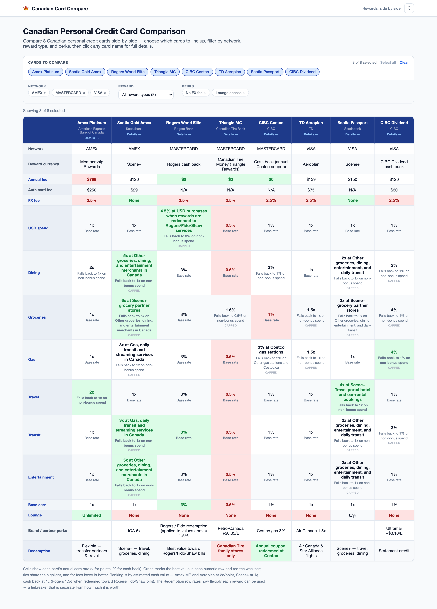
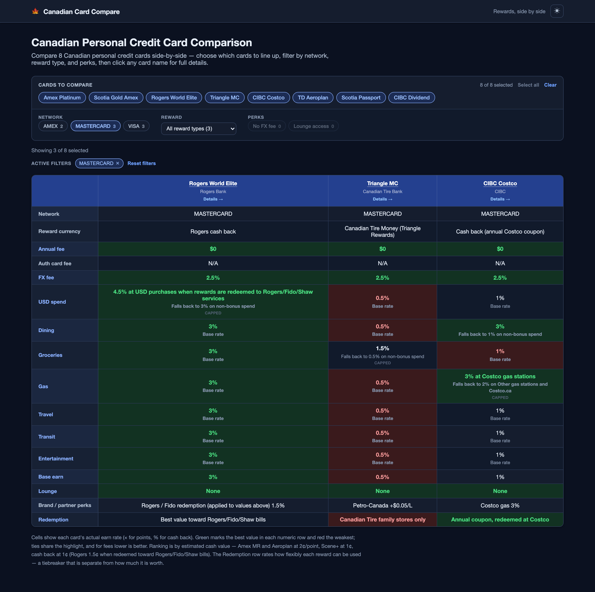
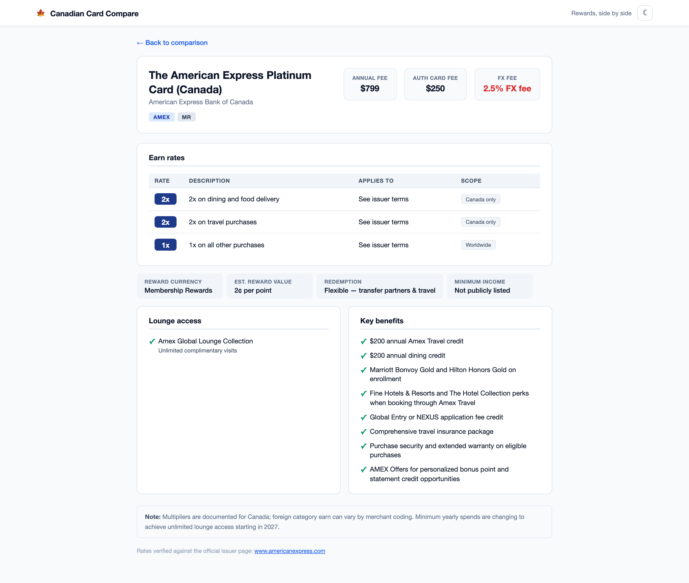

# Canadian Credit Card Comparison

A fast, fully static web app that compares Canadian personal credit cards
side-by-side and normalizes their rewards — points, Membership Rewards, and
cashback — into a single **estimated cash value** so cards with different reward
currencies can be judged apples-to-apples.


> **Disclaimer:** This is a personal side project for learning and comparison. The
> card data is hand-curated, illustrative, and may be out of date or incomplete.
> Reward valuations are conservative estimates, not guarantees. **Nothing here is
> financial advice** — always confirm details against the issuer's official terms.

## What it does

- **Filterable comparison matrix** (`/`) — all cards as columns, key attributes as
  rows (fees, FX, category earn rates, lounge access, perks). Pick exactly which
  cards to line up, then filter by network, reward type, no-FX-fee, and lounge
  access; each filter shows a live count and disables itself when it would leave no
  cards, so you can't filter the table down to nothing. Applied filters are shown as
  removable tags with a one-click reset. The best value in each numeric row is
  highlighted green and the worst red — recomputed over whatever set is on screen,
  with ties sharing the highlight.
- **Normalized rewards** — a 2x Membership Rewards rate, a 5x points rate, and a 3%
  cashback rate are converted to a comparable estimated percentage value, so
  rankings are fair across reward currencies.
- **Fallback-aware cells** — accelerated rates are shown together with what they
  fall back to (e.g. "5x … falls back to 1x on non-bonus spend").
- **Per-card detail pages** (`/[id]`) — earn-rate breakdown, lounge access, key
  benefits, spending caps, brand-specific boosts, notes, the reward valuation, and a
  link to the official issuer page each card was fact-checked against. Each page is
  statically generated at build time.

## Screenshots

**Comparison matrix** (`/`) — pick exactly which cards to line up, then filter by
network, reward type, and perks. Every filter shows a live count, and the best value
in each numeric row is highlighted green / the worst red across whatever set is on
screen:



**Dark mode + faceted filters** — the theme follows the OS setting (with a manual
toggle in the header); filters that would leave no cards disable themselves, and the
applied filters show as removable tags with a one-click reset:



**Card detail** (`/[id]`) — full earn rates, lounge access, benefits, caps, valuation, and source link:



## Tech stack

- **[Next.js 16](https://nextjs.org/)** (App Router, Turbopack)
- **React 19** + **TypeScript** (`strict`, plus `noUncheckedIndexedAccess` and
  friends)
- **CSS Modules** — no CSS framework, no runtime CSS-in-JS
- **Dark mode** — a semantic design-token layer (CSS custom properties) that
  follows the OS `prefers-color-scheme` with no JavaScript, plus a header toggle
  that persists an explicit override
- **[oxlint](https://oxc.rs/)** for linting (correctness + suspicious + a curated
  set of stricter rules, including `jsx-a11y` accessibility checks)
- **Static Site Generation** — no backend, no database; all data is versioned in
  the repo and every route is prerendered

Card data is stored as typed TypeScript ([`src/data/cards.ts`](./src/data/cards.ts)),
so the whole portfolio is version-controlled and updating an issuer's benefits is a
simple, reviewable diff.

## Getting started

**Prerequisites:** [Node.js](https://nodejs.org/) ≥ 20.9 and
[pnpm](https://pnpm.io/) (the repo pins pnpm via the `packageManager` field; npm
also works).

```bash
# install dependencies
pnpm install

# start the dev server (http://localhost:3000)
pnpm dev

# create an optimized production build
pnpm build

# serve the production build
pnpm start
```

## Scripts

| Script            | Description                                                         |
| ----------------- | ------------------------------------------------------------------- |
| `pnpm dev`        | Start the Next.js dev server.                                       |
| `pnpm build`      | Production build (every route prerendered as static/SSG).           |
| `pnpm start`      | Serve the production build.                                         |
| `pnpm lint`       | Lint with oxlint (correctness + suspicious + curated strict rules). |
| `pnpm lint:fix`   | Lint and auto-fix.                                                  |
| `pnpm typecheck`  | Type-check with `tsc --noEmit` (strict, no build output).           |
| `pnpm test`       | Run the Vitest unit suite.                                          |
| `pnpm test:watch` | Run Vitest in watch mode.                                           |

## Project structure

```
src/
├── app/         # App Router routes, layout, and route-scoped CSS Modules
├── components/  # Client UI island (ComparisonMatrix orchestrator + focused pieces)
├── data/        # Card portfolio + reward-value profiles (source of truth)
├── lib/         # Pure logic: valuation, comparison, formatting
└── types/       # Shared domain model (Card, EarnRate, RewardValueProfile, …)
```

The layering is deliberate: `lib/` holds pure functions with **no** React/Next
imports, so the valuation and comparison logic is easy to test and reason about
independently of the UI. See **[ARCHITECTURE.md](./ARCHITECTURE.md)** for a full
walkthrough of the domain model, the reward-valuation method, and the
comparison-matrix logic.

## How the valuation works (in one line)

```
estimatedValuePercent = earnRate.rateMultiplier × rewardValueProfile.value
```

Every earn rate is normalized through its card's reward-value profile (e.g.
Membership Rewards at 2.0¢/pt, cash back at 1.0¢). The comparison ranks on this
normalized value while still **displaying** each card's native rate (`x` for
points, `%` for cash back). Crucially, **how easily** a reward redeems is tracked
_separately_ (a `redemption` flexibility score, shown as its own row and used as a
tiebreaker) — so store-locked Canadian Tire Money isn't confused with universal
cash back even though both are worth 1¢. Full details in
[ARCHITECTURE.md](./ARCHITECTURE.md).

## Adding or updating cards

1. Add or edit a `Card` object in [`src/data/cards.ts`](./src/data/cards.ts).
2. If it uses a new reward currency, add a profile to
   [`src/data/rewardValuations.ts`](./src/data/rewardValuations.ts).
3. Run `pnpm lint && pnpm typecheck && pnpm build`.

The card automatically appears in the comparison matrix (and its filters) and gets
its own statically generated detail page.

## License

Released under the [MIT License](./LICENSE).
